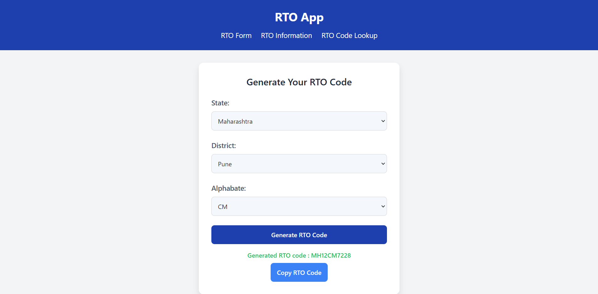

# RTO Service Application

## Overview

The **RTO Service Application** is a web-based platform designed to streamline the management and retrieval of **Regional Transport Office (RTO)** information. Built using **FastAPI** for the backend and **React.js** for the frontend, this application allows users to:

- **Lookup RTO Codes**: Search for RTO district and state information based on a specific code.
- **Generate Custom RTO Codes**: Create valid RTO codes based on selected regions and custom input.
- **Retrieve State & District Lists**: Access comprehensive lists of states and districts for administrative or transport purposes.

The application is particularly beneficial for developers, transport personnel, and government officials who need quick and accurate RTO-related data to manage vehicle registration, licensing, and administrative tasks.

---

## Use Case

The **RTO Service Application** serves various scenarios where quick and accurate RTO-related data is essential:

- **Transport Management Systems**: Helps manage vehicle registration, identify RTO codes, and track the state and district of vehicles.
- **State and District Information Lookup**: Quickly search for details of RTO codes, districts, and states for various administrative purposes.
- **Code Generation**: Useful for generating RTO codes based on specific regions and districts.
- **Developing Transport-related Applications**: Aiding developers who need to integrate RTO-related functionalities into their applications.

---

## Reason for Creation

The **RTO Service Application** was created out of necessity during a project I was working on. I was developing a product related to **RTO** (Regional Transport Office) processes, where I needed to manually enter new **RTO registration numbers**. This task was cumbersome and time-consuming, as it required frequent lookups and validation of RTO codes.

To streamline this process, I built a **basic RTO code generation tool**, which eventually evolved into this full-fledged application. Over time, I modified and enhanced the tool to not only generate RTO registration codes but also to allow for easy retrieval of district, state, and code information. The application was developed to simplify data entry, reduce errors, and provide a more efficient solution for handling RTO-related tasks.

Now, this tool is not only useful for my personal projects but can also benefit developers, system administrators, and government officials who deal with RTO data on a daily basis.

---

## Screenshots

Here are some screenshots of the **RTO Service Application** to give you a glimpse of the interface and user experience:

1. **Homepage**  
   .png>)

2. **Search for RTO Code**  
   

3. **State & District Information**  
   

4. **RTO Code Generation**  
   

5. **Generated RTO Code**  
   

6. **Real-Time Data Display**  
   

7. **Interactive Dashboard**  
   

---

## Features

- **RTO Code Lookup**: Lookup district and state information based on the RTO code.
- **State and District Lookup**: Retrieve all available states and districts.
- **Generate Custom RTO Codes**: Generate RTO codes based on a selected state, district, and custom alphabet.
- **User-Friendly Interface**: React-based frontend offering a seamless user experience.
- **Real-Time Data**: Automatically updates information on every session.

---

## Technology Stack

- **Backend**: FastAPI (Python)
- **Frontend**: React.js
- **Database**: PostgreSQL
- **CORS Support**: Managed with CORSMiddleware for handling cross-origin requests
- **Libraries & Tools**: SQLAlchemy, psycopg2, React Router, React Toastify

---

## How to Run the Project

Follow these steps to get the project up and running on your local machine:

### 1. Clone the repository:

```bash
git clone <repository-url>
```
